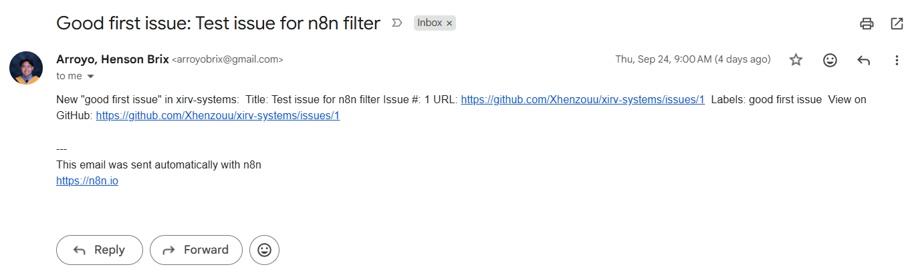

# Workflow 1: GitHub "Good First Issue" Notifier

[← Back to README](../../README.md)

**Status:** Shipped

## Problem

Manually checking a GitHub repository for contribution opportunities is repetitive and easy to forget. This workflow runs every weekday at 9:00 AM (Asia/Manila), looks for open issues labeled `good first issue`, and emails a formatted summary. When there is nothing to report, it sends nothing.

## Architecture

```
Schedule Trigger (weekday 9AM)
→ GitHub: Get Issues (open, repo: xirv-systems)
→ Filter: has 'good first issue' label AND is not a PR
→ Edit Fields: format email subject + body
→ Gmail: send summary email
```

## Key implementation details

- **Schedule.** Cron expression `0 9 * * 1-5` with timezone `Asia/Manila`. Weekdays only.
- **Label filtering.** GitHub's API returns labels as an array of objects, not strings. The filter uses `labels.some(l => l.name === 'good first issue')`.
- **PR exclusion.** GitHub's issues endpoint returns pull requests too. The filter checks `pull_request === undefined` to exclude PRs.
- **Empty-result handling.** The Filter node outputs 0 items when nothing matches, which structurally prevents Gmail from sending. No email sent means no noise.
- **Error handling.** Linked to a dedicated error workflow ([Workflow 3](./03-error-handler.md)) that emails the failure details.

## Verified behavior

The workflow was run against a repository with 2+ open issues labeled `good first issue`. The Gmail summary lists each issue in a single email.



## Stack

n8n (self-hosted) · GitHub REST API · Gmail API (OAuth2)

## Gotchas

- **GitHub's issues endpoint doesn't support label filtering reliably server-side.** Filter inside n8n instead.
- **Labels are objects, not strings.** Comparing `labels` to a string silently never matches.
- **n8n 2.x renamed "Trigger Times" to "Trigger Interval"** and moved timezone to per-workflow settings. Republish after any settings change or it won't apply to production runs.
- **Error workflows must be published** to appear in another workflow's Error Workflow dropdown.

See also the portfolio-wide [Gotchas](../../README.md#gotchas-encountered).

## Estimated impact

~5 minutes saved per manual check × ~22 weekdays = **~110 minutes/month saved**.

## Monitored by

[Workflow 10: Workflow Health Monitor](./10-workflow-health-monitor.md)