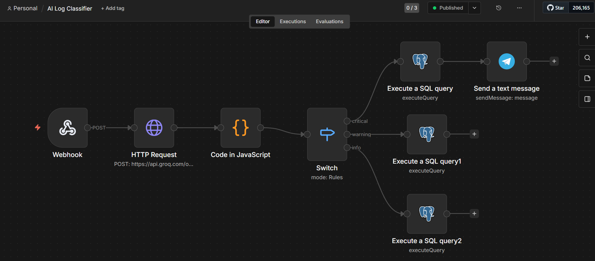
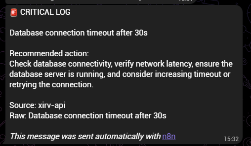

# Workflow 2: AI Log Classifier (Groq + Supabase + Telegram)

[← Back to README](../../README.md)

**Status:** Shipped

## Problem

Manual log review doesn't scale, and silent failures go unnoticed. This event-driven workflow receives application logs via webhook, classifies severity with an LLM, persists every log to PostgreSQL, and sends real-time Telegram alerts for critical entries only. Everything gets stored; only critical issues interrupt you.

## Architecture

```
Webhook (POST /log-classifier)
→ HTTP Request: Groq API (openai/gpt-oss-20b) — classify severity
→ Code: parse JSON response from Groq's content field
→ Switch: route by severity (critical | warning | info)
    ├── critical → Postgres INSERT → Telegram alert
    ├── warning  → Postgres INSERT
    └── info     → Postgres INSERT
```

## Key implementation details

- **Groq API call via HTTP Request node.** Demonstrates raw API understanding and gives full control over the request body.
- **Structured JSON output.** Uses `response_format: { type: "json_object" }` and a system prompt that defines the exact schema. Temperature `0.1` for consistent classification.
- **Response parsing.** Groq returns the classification as a JSON string inside `choices[0].message.content`. A Code node runs `JSON.parse()` and flattens the fields.
- **Cross-node data access.** The Telegram node references `$('Code in JavaScript').item.json.summary` (not `$json`) because the Postgres node's output no longer carries the classification fields forward.
- **SQL escaping.** All string fields pass through `.replace(/'/g, "''")` to escape apostrophes before INSERT.
- **Single table, three writers.** The `error_logs` table receives inserts from three separate Postgres nodes, one per severity branch. This enables different downstream actions per severity.

## Verified behavior

The full canvas shows the Switch fanning out into three Postgres branches, and a critical-severity log triggers a Telegram alert.





Test payload:

```powershell
[System.IO.File]::WriteAllText("$env:TEMP\test-log.json", '{"message": "Database connection timeout after 30s", "level": "error", "source": "xirv-api", "timestamp": "2026-09-21T15:30:00Z"}')
curl.exe -X POST http://localhost:5678/webhook/log-classifier -H "Content-Type: application/json" --data-binary "@$env:TEMP\test-log.json"
```

```sql
SELECT id, severity, summary FROM error_logs ORDER BY created_at DESC LIMIT 1;
```

## Stack

n8n (self-hosted) · Groq API · Supabase (PostgreSQL) · Telegram Bot API

## Gotchas

- **Groq wraps the JSON in a string.** The actual payload is at `choices[0].message.content` and needs `JSON.parse()`. The `reasoning` field is ignored.
- **`$json` only references the immediate previous node.** Reach earlier nodes with `$('Node Name').item.json.field`.
- **Groq model deprecation.** `llama-3.1-8b-instant` was deprecated for free tiers in August 2026. Migrated to `openai/gpt-oss-20b`.
- **Apostrophes break inline SQL.** Escape them before INSERT (see above). Parameterized queries are on the [Roadmap](../../README.md#roadmap).

## Estimated impact

Replaces manual log review. Critical alerts surface in seconds instead of during the next check.

## Monitored by

[Workflow 10: Workflow Health Monitor](./10-workflow-health-monitor.md)