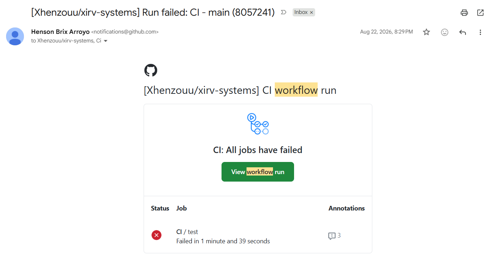

# Workflow 3: Error Handler (Supporting Workflow)

[← Back to README](../../README.md)

**Status:** Shipped

## Problem

Silent workflow failures go unnoticed until a stakeholder asks why something didn't happen. This reusable error workflow fires whenever a linked workflow fails and surfaces the failure within minutes, with enough context to debug without re-running the workflow. Silent automation failures are worse than no automation.

## Architecture

```
Error Trigger (fires on linked workflow failure)
→ Gmail: send failure notification with error details
```

## Key implementation details

- **Reusable.** One error workflow is linked from many workflows via the Error Workflow setting, giving centralized failure notifications.
- **Email contents.** Workflow name, error message, last node executed, and a link to the failed execution in n8n.
- **Must be published.** An error workflow only appears in another workflow's Error Workflow dropdown once it is published.

## Verified behavior

A deliberately failed run of a linked workflow produced this notification email, showing the workflow name, error message, failed node, and execution link.



## Stack

n8n (self-hosted) · Gmail API (OAuth2)

## Gotchas

- **Publish before linking.** Unpublished error workflows don't show in the dropdown.
- **Republish after settings changes.** n8n 2.x requires republishing for settings changes to take effect on production runs.

See also the portfolio-wide [Gotchas](../../README.md#gotchas-encountered).

## Estimated impact

Catches silent failures within minutes instead of hours.

## Monitored by

[Workflow 10: Workflow Health Monitor](./10-workflow-health-monitor.md)