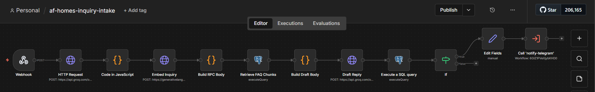
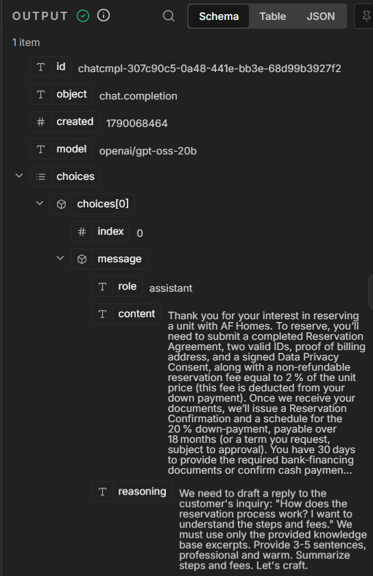

# Workflow 4: AF Homes Inquiry Intake — RAG Pipeline (Groq + Gemini + pgvector + Telegram)

[← Back to README](../../README.md)

**Status:** Shipped

> **Portfolio demonstration inspired by hospitality and property-developer workflows. Not affiliated with, endorsed by, or built for AF Homes.**

## Problem

Property developers receive inquiries across categories (bookings, VIP card questions, careers, general). Triage is manual, response drafts are repetitive, and high-value leads get missed. This event-driven pipeline receives inquiries via webhook, classifies category and priority with an LLM, extracts structured details, embeds the inquiry, retrieves semantically similar FAQ chunks from a pgvector store, drafts a grounded reply using retrieval-augmented generation (RAG), persists everything with a citation trail, and alerts high-priority inquiries via Telegram. Drafts are grounded in actual company documentation, not generic LLM output.

## Architecture

```
Webhook (POST /af-homes-inquiry)
→ HTTP Request: Groq — classify category + priority, extract structured fields
→ Code: parse Groq JSON response into flat fields
→ HTTP Request: Gemini gemini-embedding-001 — embed the inquiry (1536 dims)
→ Build RPC Body: Code node, formats vector as Postgres-compatible string
→ Retrieve FAQ Chunks: Postgres node, calls match_faq_chunks RPC
→ Build Draft Body: Code node, formats full request body for Groq
→ Draft Reply: HTTP Request: Groq — generates grounded reply from retrieved context
→ Execute a SQL query: Postgres INSERT into inquiries (with draft_reply + retrieved_sources)
→ If: priority == high
    ├── true  → Edit Fields → Call notify-telegram
    └── false → (end, no alert)
```

## Key implementation details

- **Two LLM calls per inquiry.** (1) Classification + extraction with `gpt-oss-20b`, (2) reply drafting with the same model but grounded in retrieved context.
- **Embedding with Gemini `gemini-embedding-001`.** Groq doesn't offer an embeddings endpoint. Gemini's embedding API uses a different auth header (`x-goog-api-key`) than Groq's.
- **1536-dim embeddings.** `gemini-embedding-001` natively outputs 3072 dims, but pgvector's HNSW index caps at 2000. Truncated to 1536, a divisor of 3072, which balances quality and index compatibility.
- **RAG via Postgres RPC, not PostgREST.** Supabase's PostgREST layer cached the old function signature after a `CREATE OR REPLACE FUNCTION` and returned empty arrays despite the function working in the SQL Editor. Solved by calling `match_faq_chunks` directly through n8n's Postgres node.
- **Citation trail.** The `retrieved_sources` column stores a text array of the FAQ filenames used to generate the draft reply, so grounding can be verified.
- **Precomputed request bodies in Code nodes.** Both the RPC call and the Groq draft call build their full request bodies as JSON strings in Code nodes, then send via `Body Content Type: Raw` with `={{ $json.body_string }}`. This bypasses n8n's JSON template interpolation, which flattens arrays and breaks on newlines.
- **Grounding prompt.** The system prompt says the reply must be "grounded ONLY in the provided knowledge base excerpts. If the knowledge base doesn't cover the inquiry, say so politely."
- **0.3 similarity threshold.** Calibrated via a similarity matrix: related chunks score 0.60–1.0, unrelated score 0.40–0.60.

## Verified behavior

For the inquiry *"How does the reservation process work? I want to understand the steps and fees."*, the drafted reply cited:

- 2% non-refundable reservation fee (from `reservation-process.md`)
- Two valid IDs + proof of billing + Data Privacy Consent (from `document-requirements.md`)
- 20% down payment over 18 months (from `down-payment-terms.md`)
- 30-day document window and 45–60 day timeline (from `reservation-process.md`)

Every specific number was sourced from the retrieved FAQ chunks — none invented.





Test payload and verification query:

```powershell
[System.IO.File]::WriteAllText("$env:TEMP\af-homes-test.json", '{"inquiry": "How does the reservation process work? I want to understand the steps and fees."}')
curl.exe -X POST http://localhost:5678/webhook/af-homes-inquiry -H "Content-Type: application/json" --data-binary "@$env:TEMP\af-homes-test.json"
```

```sql
SELECT id, category, priority, draft_reply, retrieved_sources FROM inquiries ORDER BY created_at DESC LIMIT 1;
```

## Stack

n8n (self-hosted) · Groq API (`openai/gpt-oss-20b`) · Google Gemini (`gemini-embedding-001`) · Supabase (PostgreSQL + pgvector) · Telegram Bot API

## Gotchas

- **HNSW index caps at 2000 dimensions.** Use `outputDimensionality: 1536` on the Gemini call.
- **Truncated embeddings lower similarity scores.** At 768 dims, related chunks scored 0.72 (uncomfortably close to unrelated). At 1536 dims, related chunks score 0.78–1.0 with clear separation.
- **PostgREST caches function signatures.** After `CREATE OR REPLACE FUNCTION`, run `notify pgrst, 'reload schema'` or bypass PostgREST with n8n's Postgres node.
- **`array_fill(0.01, 768)` is a degenerate vector.** Use a real embedding for threshold calibration.
- **Gemini `text-embedding-004` is deprecated.** Use `gemini-embedding-001`.
- **n8n JSON interpolation flattens arrays.** Precompute bodies in Code nodes and send as Raw. Raw mode treats a leading `=` as literal text.
- **Supabase pooler.** Username is `postgres.[project-ref]`, and **Ignore SSL Issues** must be enabled in n8n's Postgres credential.

See also the portfolio-wide [Gotchas](../../README.md#gotchas-encountered).

## Estimated impact

Replaces manual inquiry triage. Grounded draft replies reduce first-response time from minutes of drafting to seconds of review.

## Monitored by

[Workflow 10: Workflow Health Monitor](./10-workflow-health-monitor.md)