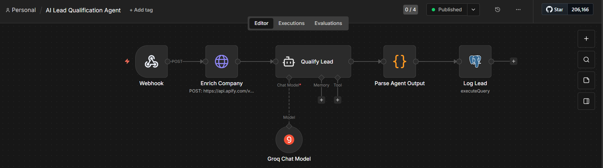
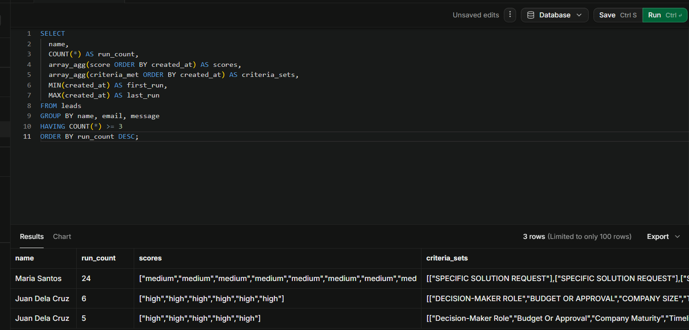

# Workflow 5: AI Lead Qualification Agent (Groq + Apify + Supabase)

[← Back to README](../../README.md)

**Status:** Slices 1 and 2 complete. Slices 3 and 4 deferred — see [Roadmap](../../README.md#roadmap).

## Problem

Manual lead triage is subjective, inconsistent, and slow. Even LLM-based scoring is unreliable when the prompt uses adjectives instead of rules. This event-driven workflow receives inbound leads via webhook, enriches them with company data from Apify, uses an AI Agent to score them as high / medium / low against explicit countable criteria, and logs the score with a machine-readable audit trail to PostgreSQL. It demonstrates how to make an AI agent's scoring deterministic, auditable, and defensible: a reliability engineering problem, not just a prompting problem.

## Architecture

```
Webhook (POST /lead-qualifier)
→ Enrich Company: HTTP Request to Apify (company-data-enricher by domain)
→ AI Agent: "Qualify Lead" — scores against 5 countable criteria
    └── Groq Chat Model: openai/gpt-oss-20b (temperature 0.0)
→ Parse Agent Output: Code node — JSON.parse + Title Case normalization + SQL escaping
→ Log Lead: Postgres INSERT into leads table
```

## The determinism fix

The strongest story in this workflow. The initial version used temperature 0.1 and a system prompt that described criteria with adjectives: *"enterprise company, specific request, decision-maker."* The same test payload scored **medium / medium / high** across three runs. The `high` run's reasoning invented a signal that wasn't present in the payload (*"implying the sender is a decision-maker"*) from a message that never named a role.

The fix had three parts:

1. **Temperature 0.0**, not 0.1. Deterministic greedy decoding.
2. **Countable criteria.** Replaced adjectives with 5 explicit signals and a numeric threshold: `high = 2+ criteria, medium = 1, low = 0`.
3. **Strictness clause.** Explicit instruction: *"Ambiguous cases lean toward the lower score, not the higher one. Do not infer signals that aren't stated."*

Result: three identical runs of the same payload now return identical scores and identical `criteria_met` arrays. Verified across 6 runs (3× medium, 3× high).

## Key implementation details

- **Countable criteria over adjectives.** The system prompt defines 5 signals: decision-maker role, budget/approval, company maturity (from enrichment), timeline, specific solution request. The scoring rule is arithmetic, not judgment.
- **Machine-readable audit trail.** The agent returns `criteria_met` as a JSON array of strings. Any reviewer can verify the score by counting the array.
- **Enrichment via Apify's company-data-enricher.** Domain-based lookup returns LinkedIn presence, domain age, technology stack, and RDAP registration data. No paid API keys required.
- **Criterion 3 requires 2+ of 4 enrichment signals.** A LinkedIn link alone doesn't pass it. This prevents a single signal from falsely flagging a company as mature.
- **Manual JSON parsing over LangChain's Structured Output Parser.** The parser rejected valid LLM output when `criteria_met` contained 4+ items. Replaced with a Code node that strips markdown fences, `JSON.parse()`s the raw string, and handles the shape in code. Same pattern as Workflows 2 and 4.
- **Empty-response guard.** Transient Groq failures sometimes return an empty `content` string. The Parse Agent Output node detects this, logs the lead with `score: low` and a clear `"Classification failed"` reasoning, and avoids losing the lead.
- **Title Case normalization in code, not in the prompt.** LLM casing drifted between `"SPECIFIC SOLUTION REQUEST"` and `"Specific Solution Request"` even at temperature 0. Fixed via `.replace(/\b\w/g, l => l.toUpperCase())` in the Code node.

## Verified behavior

Determinism test, 2026-09-23.

Three identical runs of a medium-signal lead with empty enrichment (`maria@acme.ph`) returned:

- `score: medium` all 3 times
- `criteria_met: ["Specific Solution Request"]` all 3 times
- `enrichment_summary.domain_age: null`

Three identical runs of a high-signal lead with enrichment (`juan@example.com`, an IANA-reserved domain with populated RDAP data) returned:

- `score: high` all 3 times
- `criteria_met: ["Decision-Maker Role", "Budget Or Approval", "Company Maturity", "Timeline", "Specific Solution Request"]` all 3 times
- `enrichment_summary.domain_age: "31 years"`

The `Company Maturity` criterion fires only when enrichment supports it. When enrichment returns empty, the criterion stays absent and the score reflects only the signals present in the message.





Test payload and verification query:

```powershell
[System.IO.File]::WriteAllText("$env:TEMP\lead-test.json", '{"name": "Maria Santos", "email": "maria@acme.ph", "company": "Acme Corp", "message": "We need an enterprise automation solution for our sales team."}')
curl.exe -X POST http://localhost:5678/webhook/lead-qualifier -H "Content-Type: application/json" --data-binary "@$env:TEMP\lead-test.json"
```

```sql
SELECT id, name, score, criteria_met, enrichment_summary FROM leads ORDER BY created_at DESC LIMIT 1;
```

## Stack

n8n (self-hosted) · Groq API (`openai/gpt-oss-20b`) · Apify (`company-data-enricher`) · Supabase (PostgreSQL) · LangChain AI Agent node

## Gotchas

- **LLM classification is not deterministic by default.** Temperature 0.1 is not "low enough" for consistent scores. Use temperature 0 for any workflow where the same input should produce the same output.
- **Adjectives in prompts produce nondeterministic scoring.** Countable criteria with explicit thresholds remove the LLM's room for interpretation.
- **The AI Agent's Chat Model output may appear empty.** With the Tools Agent architecture, the model's first response is a tool call (`finish_reason: "tool_calls"`), not a text completion. Don't debug the empty Chat Model output.
- **The LangChain Structured Output Parser is fragile with longer arrays.** Manual `JSON.parse()` in a Code node is more reliable and easier to debug.
- **Nested field access on external API responses silently returns undefined.** Apify returns `domainInfo.domainAge`, not `domainAge`. Verify field paths against actual API output before wiring them into prompts.
- **Title Case normalization belongs in code, not in the prompt.** Prompt instructions reduce but don't eliminate casing drift.
- **Inline array expressions in n8n's Postgres Query field are fragile.** `ARRAY[...]` with arrow functions and nested quotes broke silently in Workflow 4. Precompute SQL-safe values in a Code node.
- **Empty LLM responses happen.** Guard against them explicitly. A lead with a failed classification is still a lead.
- **n8n's Header Auth credential: "Name" is the HTTP header key, not a display label.** `Name: Apify API` produces `ERR_INVALID_HTTP_TOKEN` because spaces aren't valid in header names. Use `Name: Authorization`, `Value: Bearer <token>`.

## Estimated impact

Reduces lead triage from ~10 minutes of manual review to ~30 seconds per lead. Deterministic scoring eliminates the review-and-correct cycle that inconsistent LLM output forces.

## Monitored by

[Workflow 10: Workflow Health Monitor](./10-workflow-health-monitor.md)