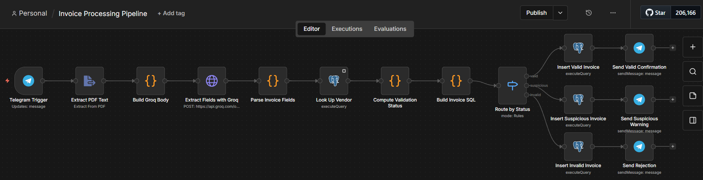
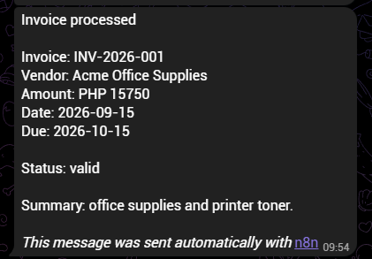
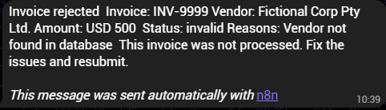

# Workflow 6: Invoice Processing Pipeline (Groq + Supabase + Telegram)

[← Back to README](../../README.md)

**Status:** v1.0.0 published. OCR support and amount formatting deferred to [Roadmap](../../README.md#roadmap).

## Problem

Manual invoice entry is slow and error-prone. Vendor fraud, duplicate submissions, and typo'd amounts go unnoticed until they reach accounting. This event-driven pipeline receives PDF invoices via Telegram, extracts the text, uses an LLM to pull structured fields, validates the vendor against a reference table, classifies the invoice as valid / suspicious / invalid, and routes to one of three branches with distinct Postgres persistence and Telegram notifications. Every submission, including rejections, gets an audit trail.

## Architecture

```
Telegram Trigger (receives PDF document)
→ Extract PDF Text (read text layer from binary)
→ Build Groq Body (Code node, precompute JSON body)
→ Extract Fields with Groq (structured field extraction)
→ Parse Invoice Fields (Code node, JSON.parse + validate schema)
→ Look Up Vendor (Postgres SELECT against vendors table)
→ Compute Validation Status (Code node, apply rules)
→ Build Invoice SQL (Code node, precompute SQL string with null handling)
→ Route by Status (Switch on status field)
    ├── valid       → Insert Valid Invoice (Postgres) → Send Valid Confirmation (Telegram)
    ├── suspicious  → Insert Suspicious Invoice (Postgres) → Send Suspicious Warning (Telegram)
    └── invalid     → Insert Invalid Invoice (Postgres) → Send Rejection (Telegram)
```

## Key implementation details

- **Telegram as input surface.** The Telegram Trigger receives PDF documents directly. No file upload endpoint needed. The trigger's "Download Images/Files" option fetches the binary and exposes it as `binary.data`.
- **PDF text extraction before AI.** `Extract from PDF` reads the text layer natively. The LLM receives plain text, not binary, which eliminates multimodal complexity and keeps extraction deterministic.
- **Structured field extraction with Groq.** Fields: `vendor_name`, `invoice_number`, `amount`, `currency`, `invoice_date`, `due_date`, `line_items_summary`. `response_format: json_object` forces valid JSON. Temperature 0.
- **Vendor validation against a reference table.** The `vendors` table holds the canonical list of approved vendors. Lookup is case-insensitive and escapes SQL metacharacters to prevent injection from LLM-extracted text.
- **Three-branch classification with explicit rules.**
  - Valid: vendor found, active, positive amount, valid currency, coherent dates.
  - Suspicious: valid vendor but one of: amount exceeds threshold, non-PHP currency, dates in wrong order, or future invoice date.
  - Invalid: vendor not found, inactive, or missing required fields.
  - Precedence: invalid > suspicious > valid.
- **Machine-readable audit trail.** Every invoice is written to `invoices` regardless of status. The `status_reasons` array documents exactly why an invoice was flagged.
- **Precomputed SQL with null handling.** The `Build Invoice SQL` Code node uses `esc()` and `num()` helpers that emit the SQL keyword `NULL` unquoted for null values. This replaced inline interpolation, which broke on DATE columns when the LLM extracted null.
- **Three-branch routing.** The Switch reads a `status` field computed upstream. Each branch has its own Postgres Insert and Telegram Send with distinct message text.

## Verified behavior

Three test invoices processed end-to-end (2026-09-24):

| Input | Vendor lookup | Classification | Result |
|-------|--------------|----------------|--------|
| Acme Office Supplies, PHP 15,750 | Found, active | valid | Inserted, confirmation sent |
| Acme Office Supplies, USD 250 | Found, active | suspicious (non-PHP currency) | Inserted, warning sent |
| Fictional Corp Pty Ltd., USD 500 | Not found | invalid (vendor not found) | Inserted, rejection sent |

The `invoices` table contains one row per status after cleanup, confirming all three branches persist data.







```sql
SELECT id, vendor_name, status, status_reasons FROM invoices ORDER BY created_at DESC LIMIT 1;
```

## Stack

n8n (self-hosted) · Groq API (`openai/gpt-oss-20b`) · Telegram Bot API · Supabase (PostgreSQL)

## Gotchas

- **`Extract from PDF` fails silently on scanned PDFs.** Image-only PDFs return an empty string or garbled text instead of an error. Validate extraction output downstream; for scans, add an OCR step.
- **`Extract from PDF` returns more than text.** Output includes `numpages`, `info.PDFFormatVersion`, `info.Author`, `info.Creator`, `info.Language`, plus `text`.
- **`Extract from File` does not validate the extracted text.** A 117 kB text-layer PDF and a corrupted PDF both produce output the node doesn't validate.
- **Nested field access on external API responses silently returns undefined.** Metadata is at `info.Author` (nested); text is top-level `text`. Verify field paths.
- **Multi-line PDF text breaks inline JSON body interpolation.** Same trap as Workflows 4 and 5. Fix: a `Build Groq Body` Code node that precomputes the body via `JSON.stringify()` and sends it as Raw.
- **Nullable fields in SQL string interpolation produce `'null'` instead of `NULL`.** Postgres rejects `'null'` for DATE columns. Precompute the INSERT in a Code node with helpers that emit `NULL` unquoted.
- **`$json` after a Postgres Insert refers to `{success: true}`, not the input data.** Reach back with `$('Node Name').first().json.field`. Fourth occurrence of this trap across the portfolio.
- **Telegram Trigger uses webhooks, which need a public HTTPS URL in production.** Test mode uses n8n's tunnel; production needs a VPS, Cloudflare Tunnel, or similar. The n8n `--tunnel` flag is deprecated and non-functional in v2.
- **`Always Output Data` is required on Postgres nodes whose SELECT may return zero rows.** Otherwise an empty result ends the workflow before the "not found" case can be handled.
- **Groq's `json_object` mode does not accept a JSON Schema.** The schema must be communicated via the prompt; Groq only validates that output is valid JSON.

## Estimated impact

Replaces manual first-pass invoice triage. Reduces per-invoice processing from ~5 minutes of manual entry and validation to under 10 seconds automated, plus a Telegram review notification for suspicious and invalid cases.

## Monitored by

[Workflow 10: Workflow Health Monitor](./10-workflow-health-monitor.md)