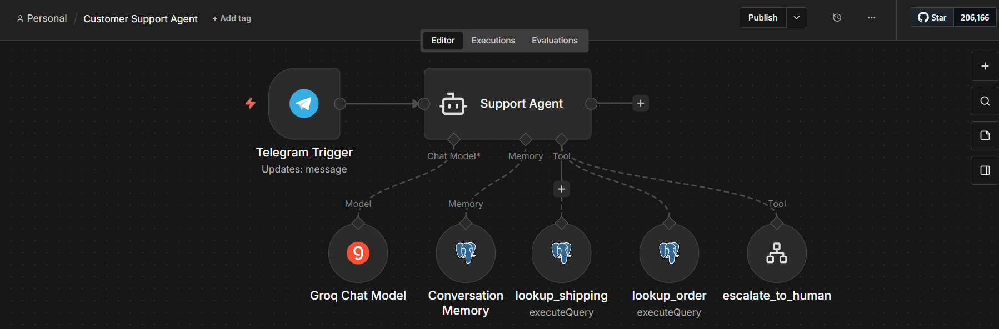
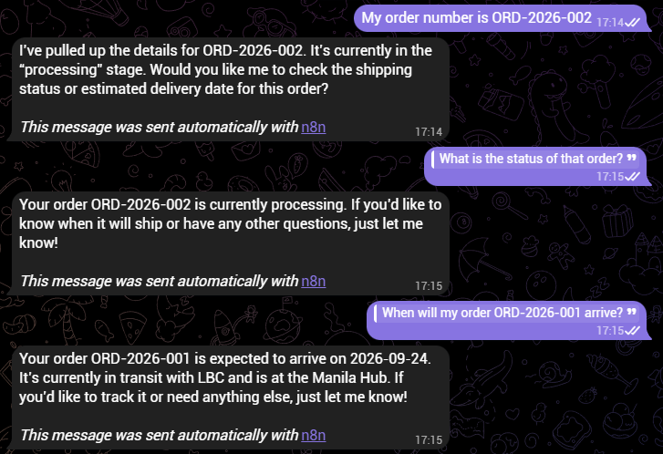

# Workflow 7: Customer Support Agent with Tool Calling (Groq + Supabase + Telegram)

[← Back to README](../../README.md)

**Status:** v1.0.0 published. Multi-language support, SLA priority, and human-agent reply routing deferred to [Roadmap](../../README.md#roadmap).

## Problem

Support teams waste time on repetitive lookup questions ("where is my order?") while complex issues get lost. This conversational Telegram agent lets an LLM decide which tool to call based on the customer's message. Three tools are available: order lookup, shipping lookup, and escalation to a human. Conversation memory persists across messages. Simple questions resolve instantly; complex cases escalate with full context (customer chat ID and the reason). The sub-workflow-as-tool pattern demonstrates the agentic architecture that job listings mean by "AI Agents."

## Architecture

```
Telegram Trigger (receives customer message)
→ AI Agent "Support Agent"
    ├── Groq Chat Model: openai/gpt-oss-20b (temperature 0)
    ├── Postgres Chat Memory (session_key = Telegram chat ID)
    └── Tool connector:
        ├── lookup_order (Postgres Tool, SELECT against orders)
        ├── lookup_shipping (Postgres Tool, JOIN orders + shipping)
        └── escalate_to_human (Call n8n Workflow Tool → escalate-and-notify)
→ (AI Agent produces grounded reply)
→ Telegram Trigger already routes the reply via the agent's response
```

Sub-workflow `escalate-and-notify`:

```
Execute Sub-workflow Trigger (reason, order_number, chat_id)
→ Postgres INSERT into escalations
→ Telegram Send to admin chat
→ Edit Fields (returns confirmation string to the parent)
```

## Key implementation details

- **Three tools, each with a specific purpose.** Tool selection is driven by the `Description` field on each tool node. Overlapping descriptions cause wrong-tool calls; clear, non-overlapping descriptions produce correct selection.
- **`lookup_order`** takes `order_number` and returns status, items, total, order date.
- **`lookup_shipping`** takes `order_number` (not tracking number, since customers don't know those) and JOINs `shipping` to `orders` to return carrier, location, estimated delivery, status.
- **`escalate_to_human`** uses the Call n8n Workflow Tool pattern. The agent supplies `reason` and `order_number` (via `$fromAI()`), plus `chat_id` from the Telegram Trigger context. The sub-workflow handles the database write and admin notification.
- **Sub-workflow as tool is the portfolio differentiator.** The agent treats the composite capability as one tool. Future changes to escalation (Slack, a ticket system, priority logic) happen in the sub-workflow without touching the agent.
- **Persistent memory via Postgres Chat Memory.** `session_key` is the Telegram chat ID, so each customer has their own history, which survives n8n restarts. "What is the status of that order?" resolves to the order number from the previous turn.
- **Temperature 0** for tool selection. Reasoning models might pick different tools based on subtle phrasing at higher temperatures.
- **System prompt operational rules.** Currency is PHP, dates use ISO format, ask for the order number if not provided.

## Verified behavior

Tested 2026-09-24:

| Test | Message | Tool called | Result |
|------|---------|-------------|--------|
| A | "What is the status of order ORD-2026-002?" | `lookup_order` | Reply includes order status, items, total |
| B | "When will my order ORD-2026-001 arrive?" | `lookup_shipping` | Reply includes LBC carrier, Manila Hub location, 2026-09-25 delivery estimate |
| C | "This is unacceptable. I want to speak to a manager about order ORD-2026-005." | `escalate_to_human` | Row inserted into `escalations`, admin Telegram notification delivered |
| D | Message 1: "My order number is ORD-2026-001" / Message 2: "What is the status of that order?" | `lookup_order` (from memory) | Reply resolves "that order" to ORD-2026-001 without re-prompting |

All four tests verify correct tool selection, correct parameter extraction via `$fromAI()`, grounded replies from tool results, and persistent conversation memory.





## Stack

n8n (self-hosted) · Groq API (`openai/gpt-oss-20b`) · Supabase (PostgreSQL) · Telegram Bot API · Postgres Chat Memory · LangChain AI Agent node with tool calling

## Gotchas

- **Tool descriptions drive agent behavior more than prompts.** Tighten descriptions before tweaking the system prompt.
- **Sub-workflow trigger default name is `When Executed by Another Workflow`,** not `Execute Sub-workflow Trigger`. Expressions referencing the wrong name break; rename the node or update references.
- **Sub-workflows must be published to be callable.** The Call n8n Workflow Tool dropdown is empty otherwise.
- **Sub-workflow references use instance-specific IDs.** Importing the parent on a different instance leaves a dangling reference. See [Sub-workflow import order](../../README.md#sub-workflow-import-order).
- **Postgres Chat Memory schema differs from expectations.** `n8n_chat_histories` has `id`, `session_id`, `message` (jsonb) and no `created_at`. Order by `id DESC`.
- **LLM date reformatting can shift dates by one day.** The model rendered `2026-09-15` as `2026-09-14` once, likely a timezone conversion. Cosmetic, not data corruption.
- **Sub-workflow trigger nodes need explicit input fields defined.** Executing the trigger without inputs produces `undefined` downstream. Test from the parent workflow unless you supply all inputs manually.

## Estimated impact

Replaces first-line support triage for order and shipping inquiries. Simple lookups resolve in under 10 seconds without human intervention. Complex cases escalate with full context (reason, order number, chat ID) in the same time window.

## Monitored by

[Workflow 10: Workflow Health Monitor](./10-workflow-health-monitor.md)