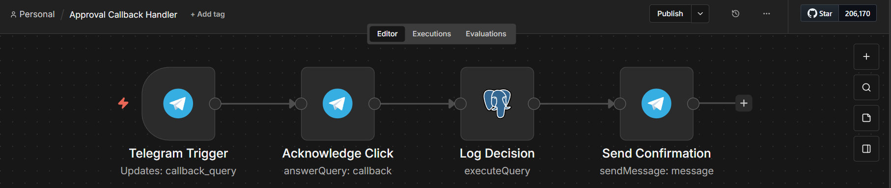
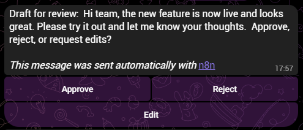
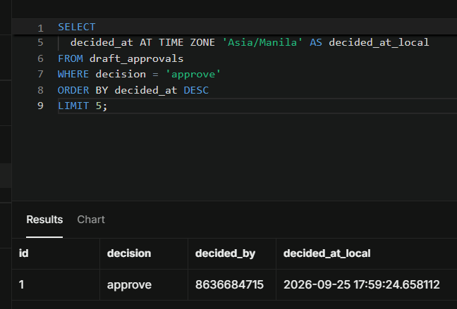

# Workflow 8b: Approval Callback Handler

[← Back to README](../../README.md)

**Status:** v1.0.0 published. Companion workflow to [Workflow 8: Human-in-the-Loop Approval](./08-human-in-the-loop-approval.md).

## Problem

When a human clicks an Approve, Reject, or Edit button in Telegram, the click arrives as a separate webhook event, not a message. Without a dedicated handler, the parent workflow would need a Wait node that holds execution open, stores a resume URL, and handles timeouts. That machinery is fragile and hard to reason about.

This workflow handles the button click as a first-class event. It receives the callback query, acknowledges the click so Telegram dismisses the loading spinner, writes the decision to the `draft_approvals` table, and sends a confirmation message back to the reviewer. The parent workflow has already exited by the time the human decides.

## Architecture

```
Telegram Trigger (Callback Query)
→ Acknowledge Click (Telegram Answer Query)
→ Log Decision (Postgres UPDATE draft_approvals)
→ Send Confirmation (Telegram Send Message)
```

Four nodes. One database write. One user-facing acknowledgement.

## Key implementation details

- **Two-workflow pattern over Wait node.** The parent workflow creates the draft row and sends the message with buttons. This workflow receives the button press, marks the row, and confirms. No held execution, no resume URL, no timeout handling.
- **Callback data carries the decision and the row ID.** Buttons are configured with `approve:<id>`, `reject:<id>`, and `edit:<id>`. The handler splits on `:` and uses both halves. The format fits inside Telegram's 64-byte `callback_data` limit with room to spare.
- **`$json` reaches back to the Telegram Trigger.** The `Acknowledge Click` node returns `{ok: true, result: true}`. Downstream nodes cannot use `$json` to access the callback data. Every reference reaches back explicitly: `$('Telegram Trigger').first().json.callback_query.data`, `.callback_query.from.id`, and `.callback_query.id`.
- **Answer Query before the database write.** Telegram requires the bot to acknowledge a callback within roughly 10 seconds. The `Acknowledge Click` node runs first so the button spinner clears immediately. The Postgres UPDATE runs after, with the operator already seeing the click registered.
- **Idempotent decision.** The UPDATE matches on `id` and sets `decision`, `decided_at`, and `decided_by`. A repeat click overwrites the same row rather than inserting a new one. The last decision wins, which matches the human's intent if they change their mind.
- **`decided_by` is the Telegram user ID.** `callback_query.from.id` is the numeric user ID of the reviewer. In a single-operator portfolio it is stable. In a team setting it distinguishes who approved what.

## Verified behavior

The 4-node canvas:



The Telegram message with buttons, sent by the parent workflow:



The decision row in Supabase after the human tapped Approve:



Walkthrough:

| Step | Result |
|------|--------|
| Parent workflow sends Telegram message with Approve / Reject / Edit buttons | Message delivered with three buttons |
| Human taps Approve | Callback query arrives at this workflow |
| `Telegram Trigger` fires on `callback_query` event | Execution starts |
| `Acknowledge Click` calls `answerCallbackQuery` | Button spinner dismisses within 1 second |
| `Log Decision` runs UPDATE on `draft_approvals` | Row updated: `decision=approve`, `decided_at=NOW()`, `decided_by=<reviewer_id>` |
| `Send Confirmation` replies to the reviewer | Confirmation message delivered |

## Stack

n8n 2.8.4 (self-hosted) · Telegram Bot API (inline keyboard + callback query) · Supabase Postgres

## Gotchas

- **Only one Telegram Trigger can hold a bot's webhook at a time.** If multiple workflows use Telegram Triggers with the same bot, the most recently published one wins. Others silently stop firing. Fix: use a separate bot per workflow with an inbound trigger.
- **Telegram callback query IDs expire in roughly 10 seconds.** The `Acknowledge Click` node cannot be tested manually. The query is stale by the time you click Execute step in the editor. Only a live button press with the workflow published exercises the node.
- **The `$json` reference is replaced after Telegram Answer Query.** `Answer Query` returns `{ok: true, result: true}`, which overwrites `$json` for downstream nodes. All references to the callback query data must use `$('Telegram Trigger').first().json.callback_query.*`.
- **`callback_data` has a 64-byte limit.** The `decision:id` format fits comfortably, but do not pack additional data into it.
- **Callback queries arrive as a distinct event type.** The Telegram Trigger's `Trigger On` setting must include `Callback Query`. If it is set to `Message` only, button clicks will not fire the workflow.
- **A known n8n bug prevents callback queries from firing when the `Restrict to Chat IDs` field is populated.** Leave that field blank for workflows that receive button clicks.
- **Telegram inline keyboard markdown parsing.** If the message text contains markdown characters (`*`, `_`, `[`), Telegram may interpret them as formatting. Set Parse Mode to `None` on the Send Message node if drafts may contain these characters.

## Estimated impact

Reduces content approval turnaround from email threads and Slack messages to a single Telegram button click. Every decision is logged with full context for audit, including who decided and when. The two-workflow pattern is reusable for any human-in-the-loop decision, not just content approval.

## Monitored by

[Workflow 10: Workflow Health Monitor](./10-workflow-health-monitor.md)