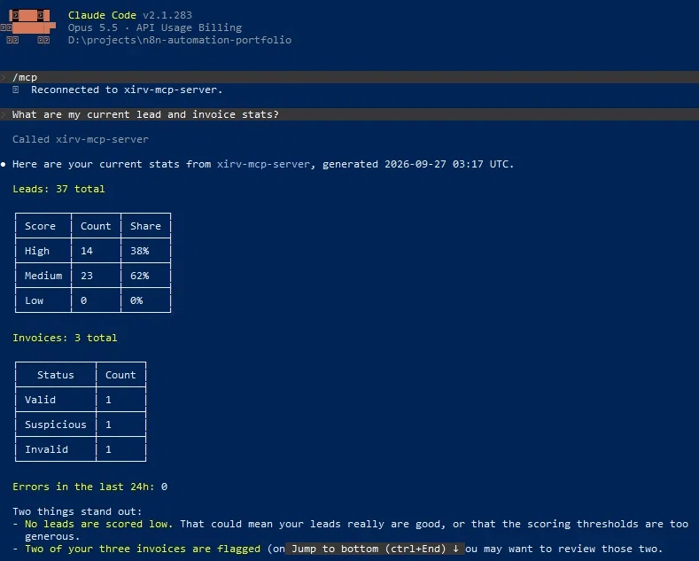
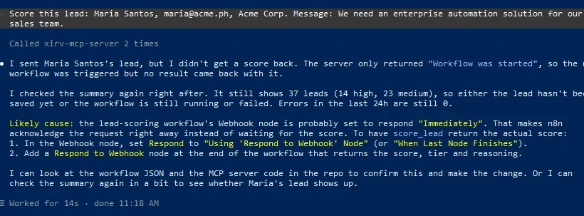

# Workflow 9: MCP Integration Server (n8n Workflows as Claude Code Tools)

[← Back to README](../../README.md)

**Status:** v1.0.0 published. Additional tools and streaming responses deferred to [Roadmap](../../README.md#roadmap).

## Problem

Existing automation lives behind webhooks, dashboards, and scheduled jobs. To use that data, someone has to open n8n, find the workflow, and read the results manually. This small Node.js server turns existing n8n workflows into tools that Claude Code (or any MCP-compatible AI agent) can call in natural language. Ask "what are my current lead and invoice stats?" and Claude Code calls the appropriate workflow, retrieves the JSON, and answers conversationally. No custom code on the AI side, none on the n8n side, just a standardized protocol both speak.

**The differentiator:** This is not "I built an MCP server." It is "I turned my existing automation into tools an AI agent can use." The first framing is jargon; the second is a capability.

## Architecture

```
Claude Code session
→ xirv-mcp-server (Node.js, stdio transport)
    ├── Tool: score_lead → POST to n8n webhook → AI Lead Qualification Agent
    └── Tool: get_summary → POST to n8n webhook → Summary Digest workflow
→ Response returned to Claude Code
→ Claude Code answers in natural language
```

Two components:

- **`mcp-server/index.js`**: Node.js server using `@modelcontextprotocol/sdk`. Defines two tools with Zod input schemas, POSTs to n8n webhooks, returns JSON.
- **`.mcp.json`** (repo root): Registers the server at project scope. When Claude Code runs from the repo root, it spawns the server automatically.

## Key implementation details

- **Two tools, no wrapper code.** `score_lead` accepts `{name, email, company, message}` and returns a lead classification. `get_summary` takes no arguments and returns a status digest. Each is a thin proxy over an n8n webhook, with no business logic in the MCP server.
- **Stdio transport.** The server speaks MCP over standard input/output. Claude Code spawns it as a child process. No ports, no HTTP, no network configuration.
- **Project-scoped `.mcp.json`.** Lives at the repo root, uses a relative path (`mcp-server/index.js`), and travels with the repo. Anyone cloning can run `claude` from the repo root and connect.
- **Startup validation.** Five checks on both webhook URLs: variable is set, starts with `https://`, no doubled `https://` prefix, no doubled slash before `/webhook/`, contains `/webhook/`. Any failure exits with a `[FATAL]` message, catching malformed URLs at startup instead of at tool-call time.
- **Explicit `.env` path resolution.** The server loads `.env` relative to its own script location, not the process CWD. Otherwise running `claude` from the repo root would break `.env` loading.
- **Zero secrets in `.mcp.json`.** It defines only the command (`node`), the arguments (`mcp-server/index.js`), and an empty env object. Secrets live in the gitignored `mcp-server/.env`; the committed `.env.example` shows the shape.
- **Async `score_lead`.** The n8n webhook returns `{"message":"Workflow was started"}` immediately and scoring happens asynchronously. Claude Code notices this and explains it back to the user without prompting.

## Verified behavior

Claude Code session transcript, 2026-09-27:

```
User: What are my current lead and invoice stats?

Claude Code: [calls get_summary via xirv-mcp-server]

Response: Here are your current stats from xirv-mcp-server, generated
2026-09-27 03:17 UTC.

Leads: 37 total

| Score  | Count | Share |
|--------|-------|-------|
| High   | 14    | 38%   |
| Medium | 23    | 62%   |
| Low    | 0     | 0%    |

Invoices: 3 total

| Status     | Count |
|------------|-------|
| Valid      | 1     |
| Suspicious | 1     |
| Invalid    | 1     |

Errors in the last 24h: 0

Two things stand out:
- No leads are scored low. That could mean your leads really are good, or
  that the scoring thresholds are too generous.
- Two of your three invoices are flagged — you may want to review those two.
```



Second query verifying the other tool:

```
User: Score this lead: Maria Santos, maria@acme.ph, Acme Corp.
Message: We need an enterprise automation solution for our sales team.

Claude Code: [calls score_lead via xirv-mcp-server]

Response: I sent Maria Santos's lead, but I didn't get a score back. The
server only returned "Workflow was started", so the workflow was triggered
but no result came back with it.

I checked the summary again right after. It still shows 37 leads (14 high,
23 medium), so either the lead hasn't been saved yet or the workflow is
still running or failed. Errors in the last 24h are still 0.

Likely cause: the lead-scoring workflow's Webhook node is probably set to
respond "Immediately". That makes n8n acknowledge the request right away
instead of waiting for the score. To have score_lead return the actual score:
1. In the Webhook node, set Respond to "Using 'Respond to Webhook' Node"
   (or "When Last Node Finishes").
2. Add a Respond to Webhook node at the end of the workflow that returns
   the score, tier and reasoning.

I can look at the workflow JSON and the MCP server code in the repo to
confirm this and make the change. Or I can check the summary again in a
bit to see whether Maria's lead shows up.
```



Both tool calls verified end-to-end: natural-language prompt, MCP tool selection, webhook invocation, real data from Supabase, natural-language response.

## Stack

Node.js · `@modelcontextprotocol/sdk` · Zod · dotenv · n8n (as backend) · Claude Code (as client) · Cloudflare Tunnel

## Gotchas

- **Four classes of URL malformation can silently break webhook calls.** Doubled `https://` prefix, doubled domain suffix (`.trycloudflare.com.trycloudflare.com`), doubled slash before `/webhook/`, and a stale tunnel URL after a restart. Startup validation catches the first three; the fourth needs manual verification when the tunnel changes.
- **`.env` files resolve relative to the process CWD by default.** Claude Code spawns the server with the session's CWD. Fix: `dotenv.config({ path: join(__dirname, '.env') })`.
- **Project-scoped MCP servers require approval on first use.** Status shows "Pending approval" until you run `claude` interactively and confirm. Approval persists in `~/.claude.json`.
- **Only one process can bind stdio at a time.** Running the MCP Inspector and Claude Code simultaneously makes the second fail silently.
- **`@modelcontextprotocol/inspector` spawns its own child process on Connect,** with the working directory wherever `npx` was invoked. Run it from inside `mcp-server/` or use `--cwd`.
- **Windows folder locks prevent `Move-Item`.** A running `node.exe`, an open VS Code window, or a shell with the folder as CWD will block the move. Kill processes, close VS Code, `cd C:\` in every shell. `Get-CimInstance Win32_Process` finds locks.
- **Leading whitespace in `.gitignore` patterns is preserved.** `  node_modules/` matches a directory with two leading spaces. `git check-ignore -v` shows how the pattern is interpreted.
- **Relative paths in `.mcp.json` require Claude Code to spawn from the repo root.** Always `cd` to the repo root before starting `claude`.
- **Absolute paths in `.mcp.json` work but don't travel with the repo.** Relative is preferred for portability.

## Estimated impact

Exposes existing automation to any MCP-compatible AI agent. Claude Code can query Supabase-backed workflows in natural language without custom code on either side. The same pattern applies to any future workflow: add a webhook, expose it as a tool, and the AI gets a new capability.

## Monitored by

[Workflow 10: Workflow Health Monitor](./10-workflow-health-monitor.md)