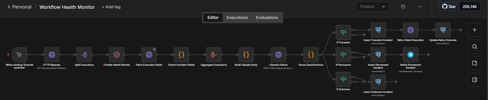
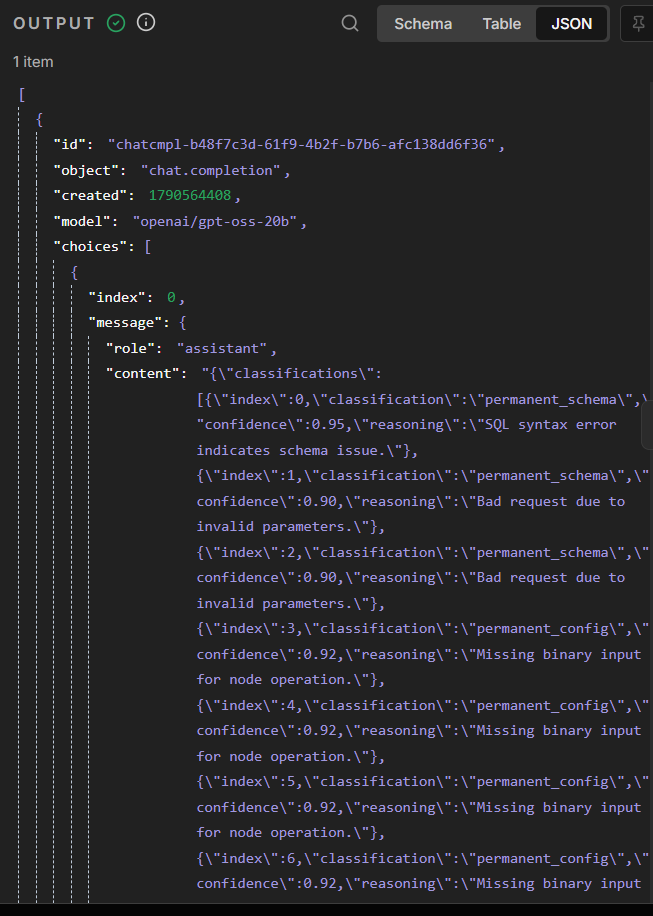
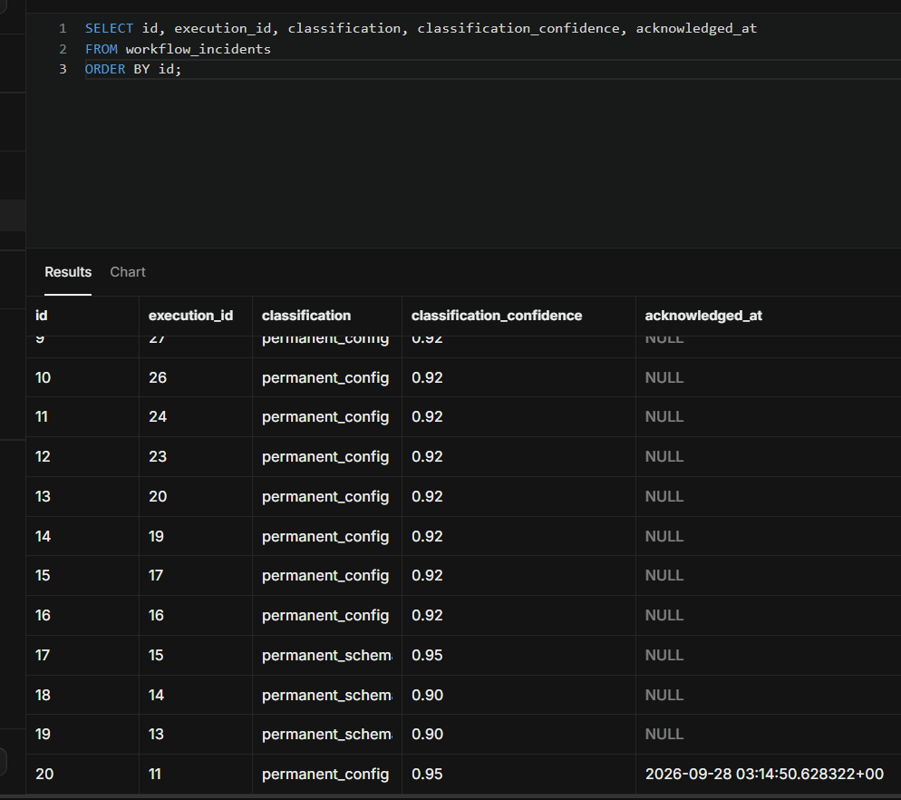
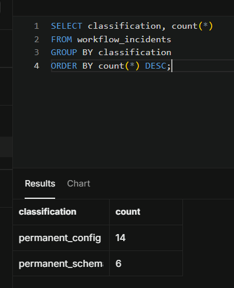
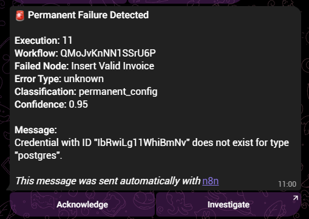
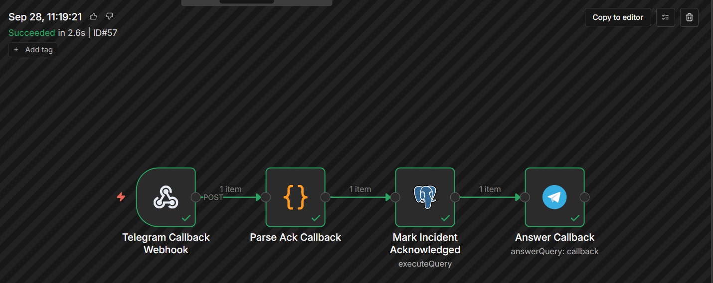
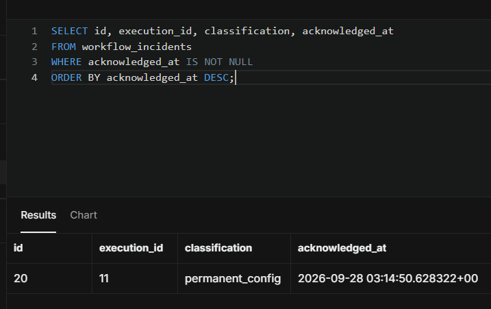

# Workflow 10: Workflow Health Monitor

[← Back to README](../../README.md)

**Status:** Shipped

## Problem

Automations break silently. A failed n8n workflow leaves an execution row in the database, but nobody is notified unless an operator opens the Executions tab. Across the job postings I scraped for Automation Specialist and AI Operations roles, reliability and error handling appeared in every single one. This project demonstrates cross-workflow health monitoring end to end: detection, classification, retry, escalation, and human acknowledgement.

## Architecture

A scheduled trigger pulls recent failed executions from the n8n Public API. Each execution's full payload is fetched individually, then stripped to six fields to keep memory flat. The slimmed items are aggregated into one batch and sent to Groq in a single classification call. The classifier returns a JSON array with one classification per item, following a six-class taxonomy with temperature 0. A Switch routes the classified items into three branches: transient, permanent, unknown. Each branch writes to `workflow_incidents`. The transient branch also retries the failed execution via the n8n retry endpoint and writes the outcome back to the incident row. The permanent branch sends a Telegram escalation with two inline buttons: `Acknowledge` and `Investigate`.

A second workflow, `Workflow Incident Callback Handler`, receives the button press, marks the incident acknowledged in the database, and dismisses the Telegram loading spinner.

## Key implementation details

- **Batched classification.** All failures are classified in one Groq call instead of N calls. The free-tier TPM ceiling (8,000 tokens per rolling 60 seconds) makes per-item classification unworkable at any Wait interval; batching sidesteps it. Effective cost: roughly 2,700 tokens per 20-item batch.
- **Six-class taxonomy.** `transient_network`, `transient_rate_limit`, `permanent_auth`, `permanent_schema`, `permanent_config`, `unknown`. Temperature 0 for deterministic output. `reasoning_effort: low` on `gpt-oss-20b` keeps reasoning tokens from consuming the JSON response budget.
- **Idempotent writes.** `workflow_incidents` carries a unique constraint on `(execution_id, classification)`. The insert uses `ON CONFLICT ... DO UPDATE SET retry_attempted = workflow_incidents.retry_attempted` to self-touch. Re-runs do not duplicate, do not error, and keep the downstream retry chain alive.
- **Retry policy.** One attempt per incident. Transient items are retried via `POST /api/v1/executions/{id}/retry`. Outcome is written to `retry_attempted`, `retry_count`, `retry_succeeded`. `Retry Failed Execution` uses `Using JSON` with `JSON.stringify({ loadWorkflow: true })` because n8n's `Using Fields Below` mode stringifies booleans.
- **Human-in-the-loop.** Telegram inline keyboard. `Acknowledge` sends a callback query to the handler workflow and writes `acknowledged_at`. `Investigate` is a URL button that opens the failing execution in the browser.
- **Memory discipline.** The n8n executions API with `includeData=true` returns roughly 600 KB per execution. An `Extract Incident Fields` Code node strips each item to six fields before aggregating, reducing the working set from ~12 MB to ~4 KB per run.

## Verified behavior

Full workflow canvas, all nodes green after an end-to-end run:

Single Groq call returning 20 classifications with confidence and reasoning per item:

`workflow_incidents` rows showing mixed classifications and confidence scores:

Classification counts across the taxonomy:

Telegram escalation with Acknowledge and Investigate buttons:

Workflow Incident Callback Handler execution, all four nodes green:

`acknowledged_at` populated after the button tap:

## Stack

n8n 2.8.4 (self-hosted) · Supabase Postgres (backing store and application tables) · Groq `openai/gpt-oss-20b` at temperature 0 · Telegram Bot API (dedicated ops bot) · Cloudflare Quick Tunnel · n8n Public API

## Gotchas

1. **Groq free-tier TPM is a rolling 60-second window.** Twenty classification calls in rapid succession exceed the 8,000 TPM ceiling regardless of Wait interval. Two Wait values (2s, then 4s) failed before the architecture changed to a single batched call.
2. **`reasoning_effort: "low"` is required on `gpt-oss-20b`.** Without it, reasoning tokens consume the completion budget and the JSON output truncates mid-array. Symptom: fewer classifications than items, and the tail items show `"unknown"` with reasoning `"no classification returned"`.
3. **HTTP Request `Using Fields Below` stringifies all values.** Even `={{ true }}` is sent as the string `"true"`. The n8n retry API rejects this with `request/body/loadWorkflow must be boolean`. Fix: use `Using JSON` with `JSON.stringify({...})`.
4. **Telegram rejects `http://localhost` URLs in inline keyboard buttons.** It returns `Bad Request: inline keyboard button URL ... is invalid: Wrong HTTP URL`. Fix: use the public tunnel URL.
5. **A stray `=` in the URL field becomes part of the string.** Telegram then reports `Unsupported URL protocol`. The `=` prefix is only meaningful when followed by `{{`. Verify the evaluated preview below the field before saving.
6. **n8n's Telegram Trigger node fails to register webhooks on self-hosted 2.8.4.** `getWebhookInfo` returns an empty `url` and `pending_update_count` grows. Fix: replace the Telegram Trigger with a standard Webhook node and register the webhook manually via `https://api.telegram.org/bot<TOKEN>/setWebhook?url=<PRODUCTION_URL>`.
7. **Telegram callback query IDs expire in roughly 10 seconds.** `Answer Query` cannot be tested manually; the query is stale by the time you click Execute step. Only a live button press with the workflow published exercises the node.
8. **Database migration side effect: imported workflows carried stale credential IDs.** Re-selecting the credential in the dropdown does not clear the stale reference. Duplicate-and-delete the node to force a fresh binding.
9. **Supabase direct connection is IPv6-only on the free tier.** External clients need the Session Pooler hostname (`aws-0-<region>.pooler.supabase.com`, port 5432). The direct host resolves but times out.
10. **Supabase certificate is not in n8n's Postgres trust store.** Enable `Ignore SSL Issues` on the credential. `SSLMODE=require` in n8n behaves like `verify-full` and fails with `self-signed certificate in certificate chain`.
11. **Self-referential monitoring.** Workflow 10 monitors its own failures, so over successive runs its own output fills the fetch window. Mitigation: raise the `limit` on `Fetch Failed Executions` or filter out the current workflow ID downstream.

## Estimated impact

For a solo operator running ten n8n workflows, manual monitoring is not feasible. This monitor catches every failure, classifies it with reasoning, retries transient errors automatically, escalates permanent errors to Telegram with one-tap acknowledgement, and preserves a searchable audit trail in `workflow_incidents`. The result: no failure goes unnoticed, and the operator only sees what requires human attention. This is the pattern agencies bill for as a reliability retainer or managed automation service.

## Roadmap (deferred)

- `Notify Unknown Incident` for the unknown classification branch.
- Pagination in `Fetch Failed Executions`.
- `workflow_name` enrichment via `GET /api/workflows/{id}`.
- `retry_succeeded` reconciliation pass querying `execution_entity` for the retried execution's final status.
- Filter Workflow 6's Telegram Trigger on `message.document` to skip non-PDF messages. This is the source of the majority of `permanent_config` failures currently classified.

## Monitors

[Workflow 1](./01-github-notifier.md) · [2](./02-ai-log-classifier.md) · [3](./03-error-handler.md) · [4](./04-af-homes-inquiry-intake.md) · [5](./05-ai-lead-qualification-agent.md) · [6](./06-invoice-processing-pipeline.md) · [7](./07-customer-support-agent.md) · [8](./08-human-in-the-loop-approval.md) · [9](./09-mcp-integration-server.md)